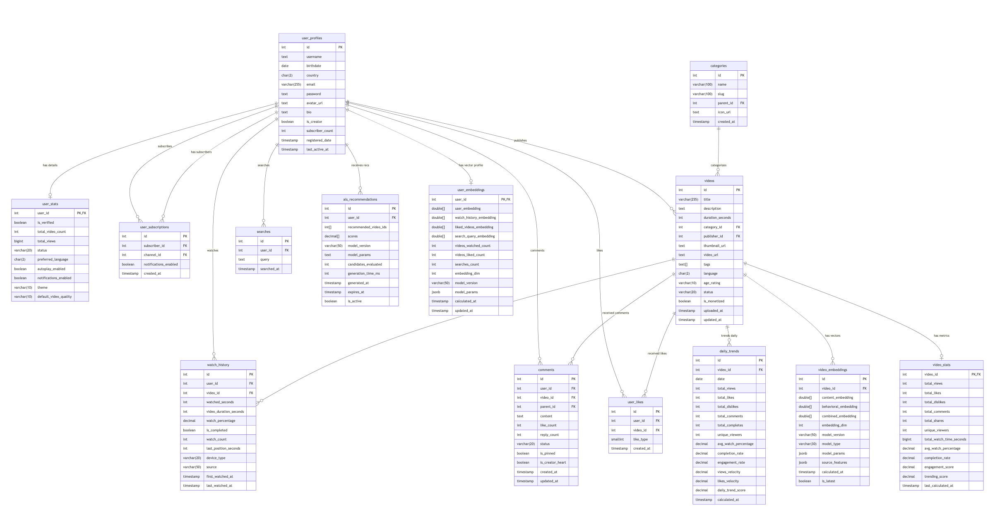
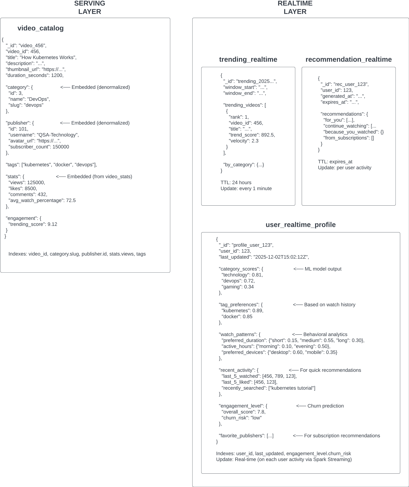
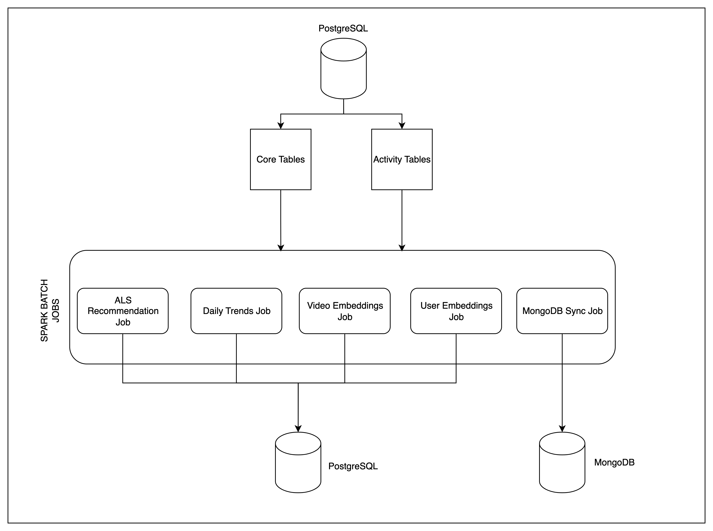
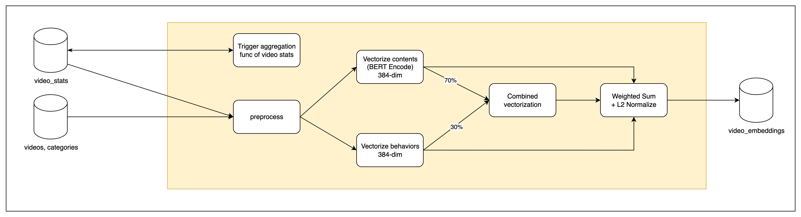
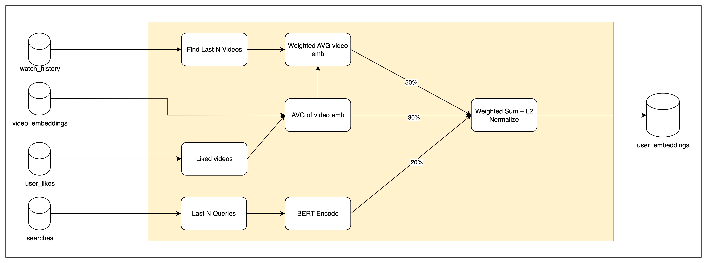
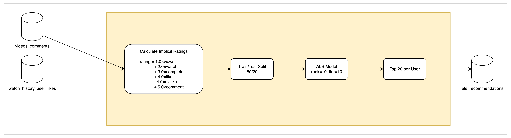
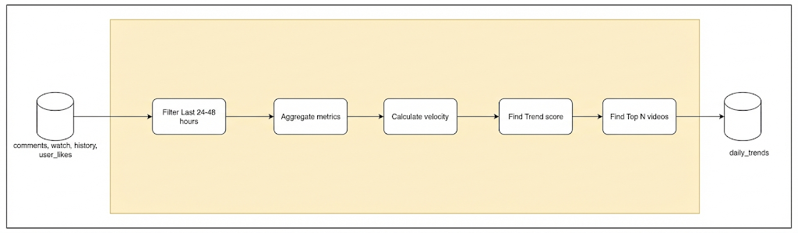
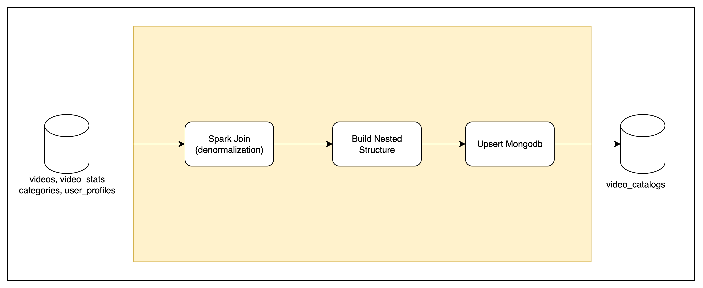
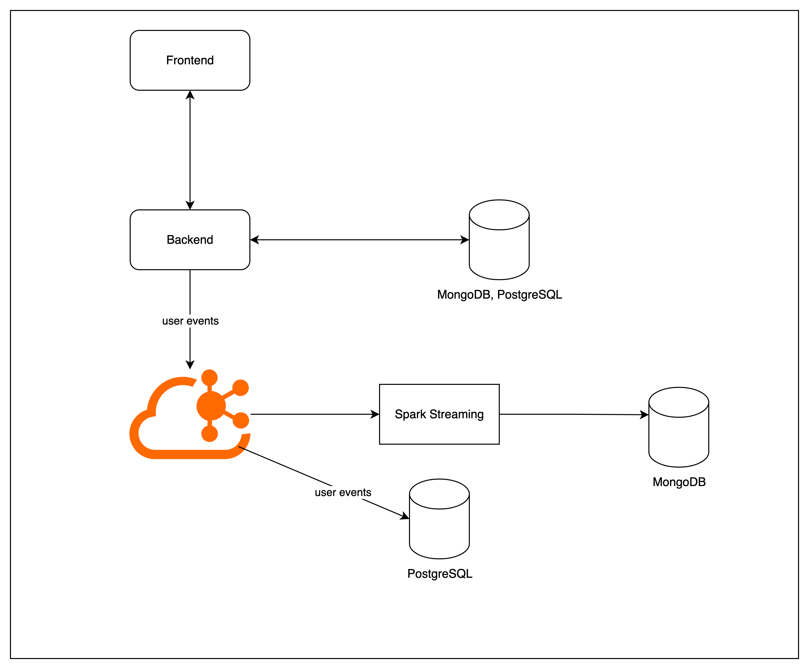

# Video Recommendation System

A hybrid video recommendation system combining **Two-Tower Neural Networks**, **Collaborative Filtering (ALS)**, and **Trending Analysis**. Built with Apache Spark for batch processing and Kafka for real-time streaming.

## Tech Stack

| Component | Technology |
|-----------|------------|
| Batch Processing | Apache Spark |
| Stream Processing | Spark Structured Streaming |
| Message Broker | Apache Kafka|
| Primary Database | PostgreSQL |
| Serving Database | MongoDB |
| ML Models | Sentence-BERT, Spark MLlib ALS |
| Orchestration | Apache Airflow |
| Language | Python |

---

## Database Design

### PostgreSQL ERD



**Schemas:**
- `core` - User profiles, videos, categories
- `activity` - Watch history, likes, comments, searches, subscriptions
- `output` - Embeddings, recommendations, trends

### MongoDB Collections



**Serving Layer:**
- `video_catalog` - Denormalized video data for fast API reads

**Realtime Layer:**
- `user_realtime_profile` - User preferences, recent activity
- `trending_realtime` - Live trending videos (1-min windows)
- `recommendation_realtime` - Session-based recommendations

---

## Batch Processing

### General Flow



All batch jobs read from PostgreSQL, process with Spark, and write results back to PostgreSQL or MongoDB.

### 1. Video Embeddings

`spark/batch/video_embeddings.py`



| Input | Output |
|-------|--------|
| videos, video_stats, categories | video_embeddings |

### 2. User Embeddings

`spark/batch/user_embeddings.py`



| Input | Output |
|-------|--------|
| watch_history, user_likes, searches, video_embeddings | user_embeddings |

### 3. ALS Recommendations

`spark/batch/als_recommendations.py`



| Input | Output |
|-------|--------|
| videos, comments, watch_history, user_likes | als_recommendations |

### 4. Daily Trends

`spark/batch/daily_trends.py`



| Input | Output |
|-------|--------|
| comments, watch_history, user_likes | daily_trends |

### 5. MongoDB Sync

`spark/batch/mongodb_sync.py`



| Input | Output |
|-------|--------|
| videos, video_stats, categories, user_profiles | MongoDB video_catalog |

---

## Real-Time Processing



User events flow from Frontend → Backend → Kafka → Spark Streaming → MongoDB.

### Storage Architecture Note

> **Local Development vs Production:**
> 
> In a production environment, raw event data and intermediate processing results would typically be stored in **HDFS (Hadoop Distributed File System)** for:
> - Scalable storage of large event streams
> - Fault-tolerant data persistence
> - Efficient batch processing with Spark
> 
> However, this project uses **PostgreSQL** as the primary storage for local development simplicity. The architecture can be easily adapted to HDFS by modifying the Spark read/write configurations in stream jobs.
> 
> **Production path:** `Kafka → Spark Streaming → HDFS (raw) → Spark Batch → PostgreSQL/MongoDB (serving)`
> 
> **Local path:** `Kafka → Spark Streaming → PostgreSQL → MongoDB (serving)`

### Kafka Event Schema

**Topic:** `user_interactions`

```json
{
  "user_id": "123",
  "video_id": "456",
  "event_type": "view",
  "details": {...},
  "timestamp": "2025-12-02T15:02:12Z"
}
```

### Event Types

| Event Type | Details | Description |
|------------|---------|-------------|
| `view` | `{ "source": "home\|search\|recommendation" }` | Video view started |
| `progress` | `{ "watch_percentage": 45.2, "duration_watched": 420 }` | Watch progress update |
| `complete` | `{ "watch_percentage": 100, "total_duration": 930 }` | Video completed |
| `like` | `{ "like_type": 1 }` | Video liked |
| `dislike` | `{ "like_type": -1 }` | Video disliked |
| `comment` | `{ "comment_id": 789, "parent_id": null }` | Comment posted |
| `share` | `{ "platform": "twitter\|facebook\|link" }` | Video shared |
| `search` | `{ "query": "kubernetes tutorial" }` | Search performed (video_id is null) |
| `subscribe` | `{ "publisher_id": 101 }` | Subscribed to channel |
| `unsubscribe` | `{ "publisher_id": 101 }` | Unsubscribed from channel |

### Stream Jobs

| Job | Output Collection | Update Frequency |
|-----|-------------------|------------------|
| `user_profile_rt.py` | user_realtime_profile | Per user action |
| `trending_videos_rt.py` | trending_realtime | Every 1 minute |
| `recommendation_rt.py` | recommendation_realtime | Every 30 minutes |

---

## Airflow Orchestration

### DAG Structure

```
video_recommendation_daily_dag
│
├── video_embeddings_task (02:00)
│   └── user_embeddings_task (03:00)  # depends on video_embeddings
│
├── als_recommendations_task (04:00)
│
└── daily_trends_task (hourly)


video_catalog_sync_dag
│
└── mongodb_sync_task (every 15 min)
```

### Schedule

| DAG | Task | Schedule | Dependencies |
|-----|------|----------|--------------|
| `daily_dag` | video_embeddings | Daily 02:00 | - |
| `daily_dag` | user_embeddings | Daily 03:00 | video_embeddings |
| `daily_dag` | als_recommendations | Daily 04:00 | - |
| `daily_dag` | daily_trends | Hourly | - |
| `sync_dag` | mongodb_sync | Every 15 min | - |

---

## Project Structure

```
VideoRecommendationSystems/
├── spark/
│   ├── batch/
│   │   ├── video_embeddings.py
│   │   ├── user_embeddings.py
│   │   ├── als_recommendations.py
│   │   ├── daily_trends.py
│   │   └── mongodb_sync.py
│   ├── stream/
│   │   ├── user_profile_rt.py
│   │   ├── trending_videos_rt.py
│   │   └── recommendation_rt.py
│   └── utility.py
├── airflow/
│   └── dags/
├── db/
│   ├── migrations/
│   └── data/
│       ├── postgresql/
│       └── mongodb/
├── db_connector/
│   ├── postgres_connector.py
│   └── mongo_connector.py
├── config.py
└── README.md
```

---

## Setup

### Requirements

```bash
pip install pyspark sentence-transformers pymongo psycopg2-binary python-dotenv
```

### Database Setup

Before running migrations, create the required schemas:

```sql
-- Create schemas
CREATE SCHEMA IF NOT EXISTS core;
CREATE SCHEMA IF NOT EXISTS activity;
CREATE SCHEMA IF NOT EXISTS output;

-- Grant permissions (if needed)
GRANT ALL ON SCHEMA core TO your_user;
GRANT ALL ON SCHEMA activity TO your_user;
GRANT ALL ON SCHEMA output TO your_user;
```

### Environment Variables

```env
# PostgreSQL
PG_DB_URL=jdbc:postgresql://localhost:5432/video_rec
PG_DB_USER=postgres
PG_DB_PW=password
PG_DB_NAME=video_rec
PG_PORT=5432
PG_DB_CORE_SCHEMA=core
PG_DB_ACT_SCHEMA=activity
PG_DB_OUTPUT_SCHEMA=output

# MongoDB
MONGODB_URI=mongodb://localhost:27017
MONGODB_DB_NAME=video_rec

# Kafka
CONFLUENT_BOOTSTRAP_SERVERS=xxx.confluent.cloud:9092
CONFLUENT_API_KEY=xxx
CONFLUENT_API_SECRET=xxx
CONFLUENT_INTERACTION_TOPIC=user_interactions
```

### Running Batch Jobs

```bash
python -m spark.batch.video_embeddings
python -m spark.batch.user_embeddings
python -m spark.batch.als_recommendations
python -m spark.batch.daily_trends
python -m spark.batch.mongodb_sync
```

---

## Future Enhancements

### Planned Improvements

- **Advanced AI Embeddings**: Replace current Sentence-BERT with more sophisticated models:
  - Fine-tuned domain-specific transformers for video content
  - Multimodal embeddings (video frames + audio + text)
  - Contrastive learning for user-video similarity
  
- **Vector Database Integration**: Migrate embeddings to dedicated vector databases (Pinecone or pgvector) for faster similarity search at scale

- **Real-time Personalization**: Implement online learning to update user embeddings in real-time based on streaming events